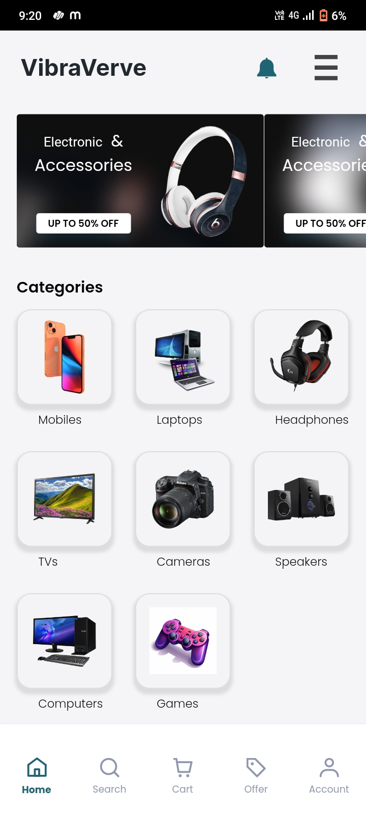
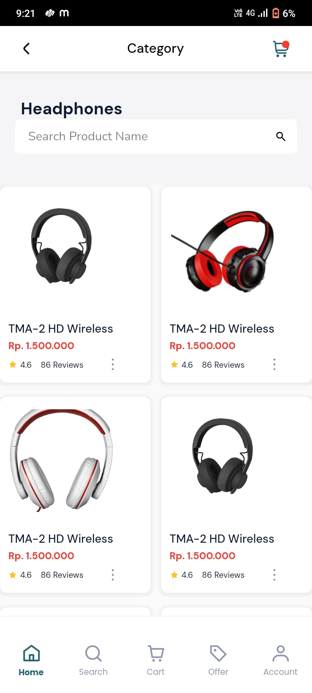
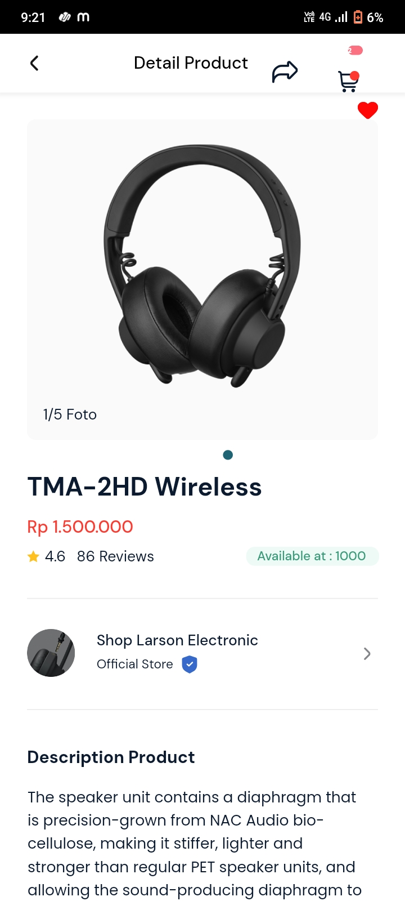
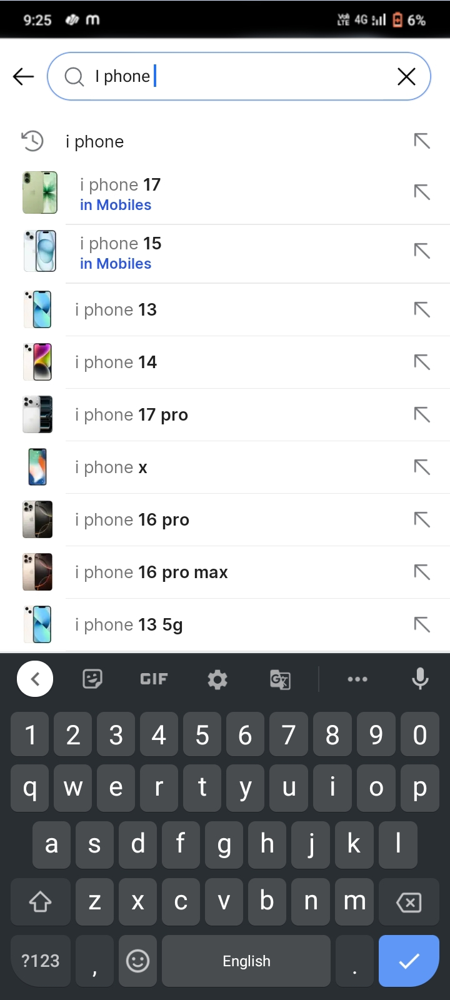
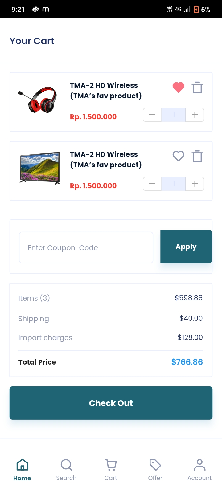
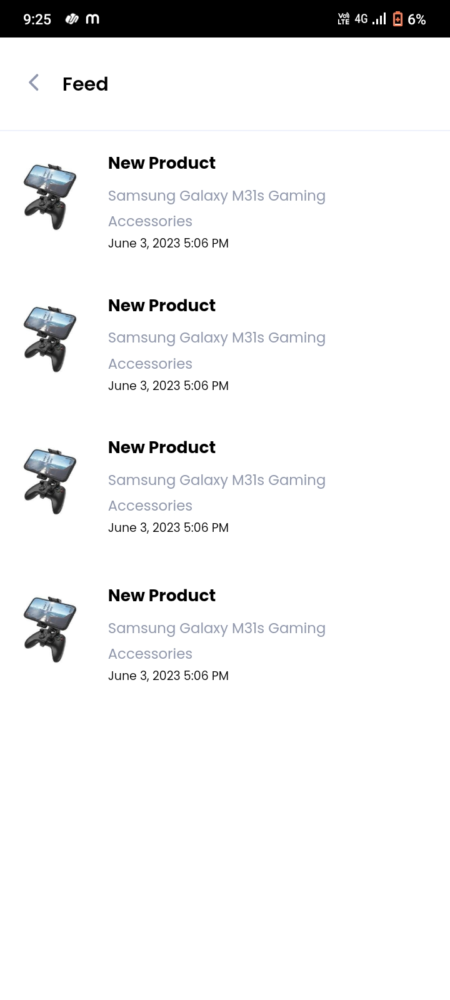
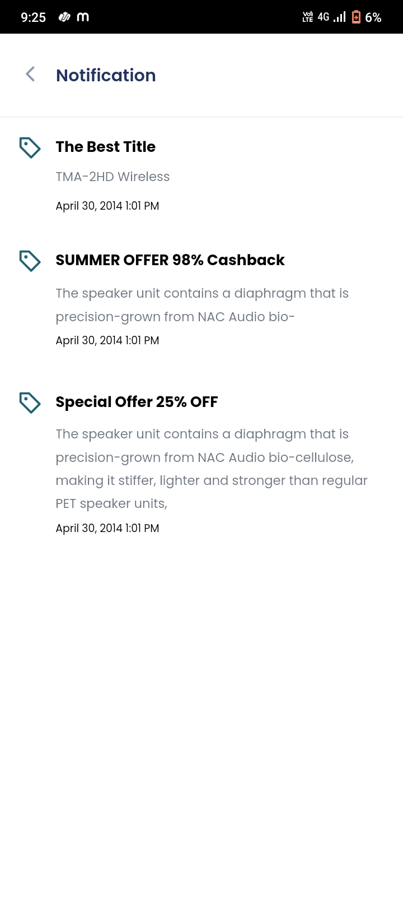
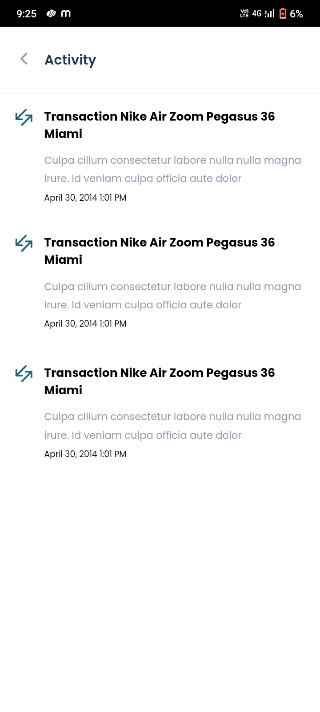
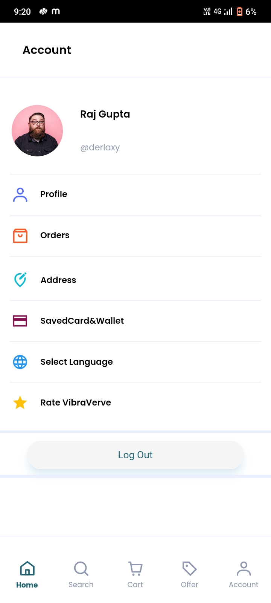

# Vibra Verbe 🛒

An advanced **E-Commerce mobile application** built with **Flutter** and **GetX** for seamless shopping experiences.
The app integrates authentication, product browsing, cart, checkout, and order tracking with a clean UI and scalable architecture.

---

## 📸 Screenshots

<table>
<tr>
<td></td>
<td></td>
<td></td>
<td></td>
<td></td>
<td></td>
<td></td>
<td></td>
<td></td>
<td></td>
<td></td>
</tr>
</table>

## ✨ Features

* 🏪 **E-Commerce Essentials**: Browse products, add to cart, wishlist, and checkout
* 🔑 **Authentication**: Google Sign-In integration
* 📶 **Connectivity Handling**: Online/offline detection with `connectivity_plus`
* 💾 **Local Storage**: Save user data and preferences with `shared_preferences`
* 🌐 **Internationalization (i18n)**: Multi-language support using `intl` & `flutter_localization`
* 📱 **Modern UI**: Carousel banners, stepper checkouts, OTP fields, rating system
* 📅 **Order & Delivery Tracking**: Calendar-based scheduling with `table_calendar`
* ⚡ **State Management**: Smooth navigation & reactivity with **GetX**

---

## 🛠 Tech Stack

* **Framework**: Flutter (Dart)
* **State Management & Routing**: GetX
* **Authentication**: Google Sign-In
* **Data Persistence**: Shared Preferences
* **Utilities & UI**: Cached images, Carousel, Page Indicators, Rating Bars
* **Internationalization**: intl, flutter\_localization

---

## 📦 Packages Used

* get: ^4.6.5
* connectivity\_plus: ^2.3.6
* shared\_preferences: ^2.2.2
* cached\_network\_image: ^3.2.1
* flutter\_svg: ^1.1.6
* google\_sign\_in: ^5.0.7
* pin\_code\_fields: ^7.3.0
* flutter\_rating\_bar: ^4.0.0
* country\_pickers: ^2.0.0
* smooth\_page\_indicator: ^1.0.0+2
* sms\_autofill: ^2.0.0
* carousel\_slider: ^4.0.0
* table\_calendar: ^3.0.6
* another\_stepper: ^1.2.2
* intl: ^0.18.0
* flutter\_localization: ^0.2.0

---

## 🚀 Installation & Setup

1. **Clone the repository**

   ```bash
   git clone https://github.com/your-username/Vibra_Verbe.git  
   cd Vibra_Verbe-main  
   ```

2. **Install dependencies**

   ```bash
   flutter pub get  
   ```

3. **Run the app**

   ```bash
   flutter run  
   ```

---

## 🤝 Contributing

We welcome contributions!

1. Fork this repo
2. Create a new branch (`feature/your-feature`)
3. Commit and push your changes
4. Create a Pull Request

---

## 📜 License

This project is licensed under the **MIT License**.

---

## 👨‍💻 Author

Developed with ❤️ using Flutter & GetX.

* **Name:** Raj Gupta
* **GitHub:** [Rajgupta321](https://github.com/rajgupta321)
* **LinkedIn:** [Rajgupta](https://linkedin.com/in/raj-gupta-b055a0296)

